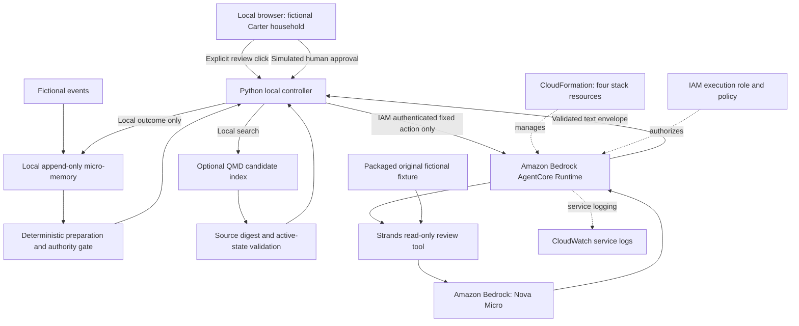

# Architecture

## Local-first foundation

```text
Fictional household events
          |
          v
Append-only micro memory
  facts | commitments | preferences | decisions
          |
          v
Deterministic interruption gate
     | quiet          | decision needed
     v                v
prepared work      bounded decision packet
     \                /
      \              /
       Strands agent explanation
                |
                v
        Household-facing interface
```

The deterministic gate owns authority. Strands may explain, organize, and call
allowlisted tools, but it cannot silently convert a suggestion into a household
decision.

## Accepted demonstration architecture

```text
Local household experience
  fictional Carter fixture
  deterministic preparation and authority gate
                  |
                  | explicit review action only
                  v
Amazon Bedrock AgentCore Runtime
  Python 3.12 CodeZip
  bounded Family Steward entrypoint
  Strands agent with one read-only review tool
                  |
                  v
Amazon Bedrock / Nova Micro
  receives only the bounded fictional decision packet
```

The demonstration deploys only the agent reviewer. The household controller,
fictional memory, QMD candidate discovery, and approval simulation remain local.
There is no public endpoint, database, scheduler, persistent agent process, or
real household data. AgentCore is invoked explicitly for judging evidence and
can be deleted after the submission proof is captured.

## Future production mapping

| Local component | Candidate AWS service | Activation rule |
| --- | --- | --- |
| Strands reasoning | Amazon Bedrock Nova Micro | After offline adapter tests |
| Micro memory | DynamoDB | After local schema acceptance |
| Scheduled scans | EventBridge + Lambda | After quiet-mode proof |
| Agent runtime | Bedrock AgentCore | Accepted for the disposable judging proof |
| Static interface | S3/CloudFront or Amplify | After product flow acceptance |

## Deployed service diagram



CloudFormation's fourth resource is CDK Metadata. AgentCore's DEFAULT endpoint
and workload identity are service-managed lifecycle resources. No database,
scheduler, public API gateway or AgentCore Memory service is used.

Deployment succeeded September 3; the browser-to-AgentCore connection passed
September 5. The only invocation payload is the fixed review action. The cloud
reads its packaged fixture, not the local controller's mutable memory. The client
blocks review after local approvals and permits one paid attempt per server run.

The diagram describes the implemented hybrid demo, not a fully hosted app.

